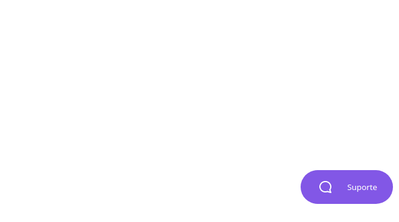
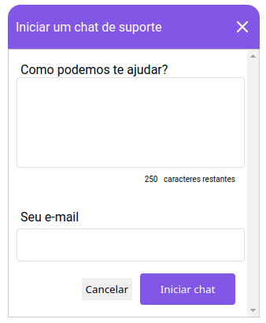
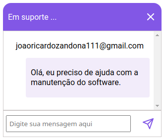
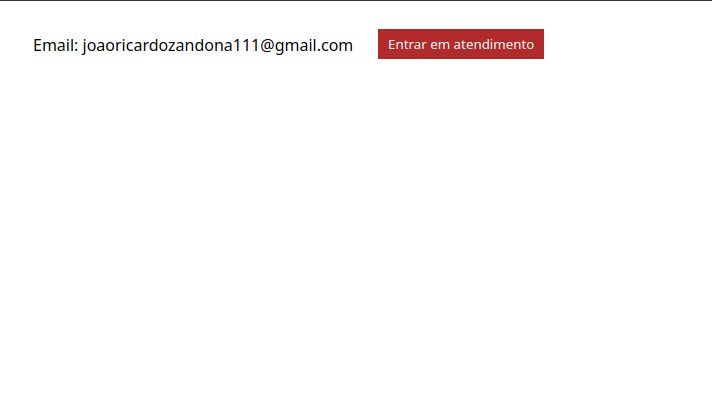
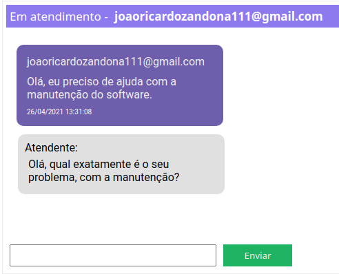
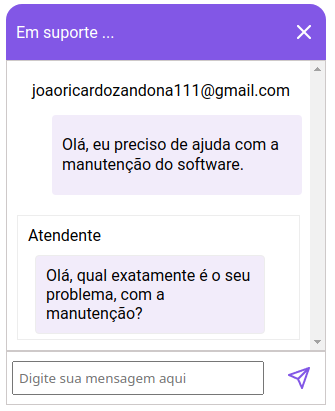

<br />

<p align="center">
  
</p>

<h1 align="center" style="text-align: center;">Suporte</h1>

<p align="center">
	<a href="https://github.com/joaozandona">
		
	</a>
	<a href="#">
		
	</a>
	<a href="#">
		
	</a>
</p>

<p align="center">
	<br /><b>Suport system!</b><br />
  A project developed during NLW5.
  <br />
	<span>Chat system between admin, and user, for support.</span><br />
	<sub>To the moon! 🚀</sub>
</p>

<br />

<p align="center">
	<b>User screen</b><br />
  
  <b>Starting contact with the admin</b><br />
	
	<br />
  <b>Chat with admin</b><br />
	<br />
  <b>Admin screen</b><br />
	
	<br />
	<b>Admin chat</b><br />
  <br />
	<b>User screen with admin response</b><br />
  
</p>

<br />

# :pushpin: Contents

- [Features](#rocket-features)
- [Installation](#wrench-installation)
- [Getting started](#bulb-getting-started)
# :rocket: Features

### User

- Quick chat between admin and user.
- Saves the message history by email.

### Admin

- It can help multiple users at the same time.
- Automatically removes those who are already in service from the list.
- Automatically list new calls.

# :wrench: Installation

### Required :warning:
- Yarn
- Node.js

### SSH

SSH URLs provide access to a Git repository via SSH, a secure protocol. If you have an SSH key registered in your GitHub account, clone the project using this command:

```git clone git@github.com:joaozandona/nlw5-node-backend-chat.git```

### HTTPS

In case you don't have an SSH key on your GitHub account, you can clone the project using the HTTPS URL, run this command:

```git clone https://github.com/joaozandona/nlw5-node-backend-chat.git```


# :bulb: Getting started

### Web

1. Open the folder an run ```yarn``` to install the dependencies;
2. Run ```yarn dev``` to open the web application on port 3333.
3. User page: "localhost:3333/pages/client".
4. Admin page: "localhost:3333/pages/admin".


